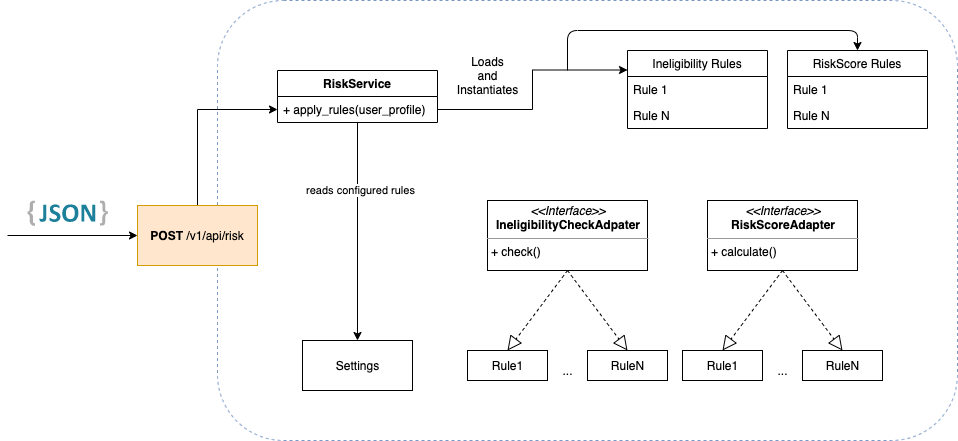

# Insurance Recommendation Engine (IRE)

[](https://github.com/psf/black)
[](https://pycqa.github.io/isort/)

This application receives the user profile through the API and transforms it into a risk profile by calculating a risk score for each line of insurance (life, disability, home & auto) based on the information.

**Test Coverage: 97%**

## Setup

**Requirements:**

- Python ^3.7
- [Poetry](https://python-poetry.org/)
- Optional: [pre-commit](https://pre-commit.com/)

### Running locally

**Required steps:**

Then:

Install dependencies.

```
poetry install
```

Spawn a virtualenv and activate it.


```
poetry shell
```

Start the application:

```
uvicorn main:app --reload --app-dir ire
```

### Pre-commit

```
pre-commit install
```

### Tests

This projects uses [pytest](https://docs.pytest.org/en/stable/).

```
pytest --cov=ire --cov-report html tests
```

## Overview

### Libraries

This projects relies on [FastAPI](https://fastapi.tiangolo.com/) as the web framework.

The reasoning for this decision were many:

- A micro-framework, fast to code, with a simple and easy to use routing system;
- Automatic interactive API documentation;
- The usage of Pydantic for data validation, and settings management using python type annotations.

## Architecture

This projects uses the pattern of ["Pluggable Backends"](http://charlesleifer.com/blog/django-patterns-pluggable-backends/) to make an extensible recommendation engine.

All configuration right now is in the file `ire.core.config`.

It is worth to mention two important ones:

- RISK_SCORE_RULES
- INELIGIBILITY_RULES

They are a list of string which contains the full path to the respective classes that implements the risk rules logic.

The advantage of this approach is to provide loose coupling between the risk service and the rules, making it easy to add/remove rules.

It also provides easier testing.

The below image summarizes this strategy:



## API Documentation

Interactive documentation is available on:

http://127.0.0.1:8000/docs
